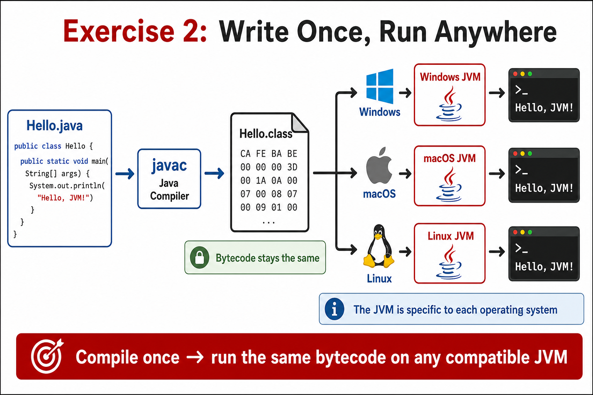
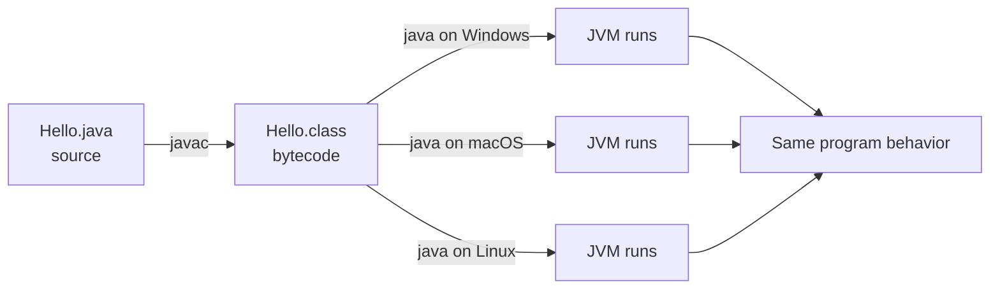

# Exercise — Platform Independence (WORA)

**Module 1** · Pre-lab practice · finish all 8, then [`../lab1/LAB-1-GUIDE.md`](../lab1/LAB-1-GUIDE.md)  
**Folder:** `examples/module-01-exercises/` ([setup](EXERCISES-INDEX.md))



## Goal

Run an existing `.class` with `java`. Note why recompile is not required for another OS JVM.

## Easy idea (WORA)

| Piece | What it is | Portable? |
| ----- | ---------- | --------- |
| `.java` source | What you type | Yes (text), but not what the OS runs |
| `.class` bytecode | Output of `javac` | Yes — same bytes on Windows/macOS/Linux |
| JVM (`java`) | Runtime that understands bytecode | Installed per OS, but reads the same `.class` |

**Write once, run anywhere:** compile once to bytecode; any matching JVM can run that `.class` without changing your source for each OS.



## Do this

**Why:** Prove you are running bytecode, not re-interpreting the `.java` file each time.

| Command | Easy meaning |
| ------- | ------------ |
| `java Hello` | Start JVM, load `Hello.class`, run `main` (no `javac` needed if `.class` already exists) |

**Windows:**

```powershell
cd $env:USERPROFILE\java-bootcamp\examples\module-01-exercises
java Hello
```

**macOS:**

```bash
cd ~/java-bootcamp/examples/module-01-exercises
java Hello
```

**Expected:** Something like `Hello, JVM!` (same as Exercise 1 — no `javac` needed if `.class` already exists).

**Verified (Windows):** `java Hello` prints:

```text
Hello, JVM!
```

(Re-run without recompiling proves you are executing bytecode, not re-reading the `.java` file.)

- Write 2–3 sentences: source vs bytecode vs JVM (save as `notes/wora-notes.md` under the workspace)

**Sample note:**

```text
The source code in a java project is the human-readable text / code created by developers, in this case the Hello.java file. 
The compiler (javac) turns the source code into machine-readable bytecode, in this case Hello.class. 
Lastly, the JVM executes the bytecode on a user's machine, which is platform-specific.
```

## Expected result

Short note explains WORA using your `.class` experience.

## Pass criteria

_Mark each row **Pass** or **Fail** in your lab notes (GitHub markdown files are not interactive checklists)._

| # | Confirm | Your notes |
| - | ------- | ---------- |
| 1 | Code compiles and runs (or notes complete if analysis-only) | Pass |
| 2 | You can explain the result in one sentence | Pass |
