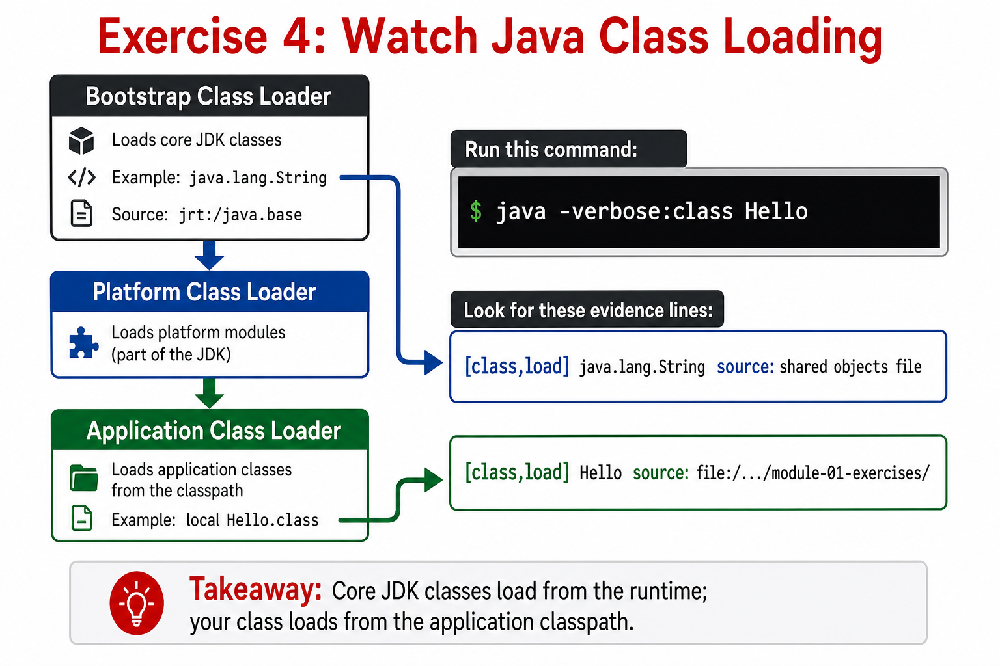

# Exercise — Watch Class Loading

**Module 1** · Pre-lab practice · then open [`../../lab1/LAB-1-GUIDE.md`](../lab1/LAB-1-GUIDE.md)  
**Folder:** `examples/module-01-exercises/` (see [EXERCISES-INDEX.md](EXERCISES-INDEX.md) setup)



## Goal

Run `Hello` with `-verbose:class` and identify which class loader loaded `Hello` versus a core JDK class like `String`.

## Starter / reference

Reuse `Hello.java` from Exercise 1 (Hello World) — no new source file needed for this one.

## Do this

**Why:** Connect the Bootstrap / Platform / Application class loaders you just saw to real JVM output.

From the exercises folder (after `javac Hello.java` has produced `Hello.class`):

**Windows:**

```powershell
cd $env:USERPROFILE\java-bootcamp\examples\module-01-exercises
java -verbose:class Hello | Select-String "Hello|String"
```

**macOS:**

```bash
cd ~/java-bootcamp/examples/module-01-exercises
java -verbose:class Hello | grep -E "Hello|String"
```

| Line contains | Loaded by | Why |
| -------------- | --------- | --- |
| `java.lang.String` | Bootstrap (source: shared objects file / `jrt:/java.base`) | Core JDK class — always loaded first, by the JVM itself |
| `Hello` | Application (source: your own `.class` file's path) | Your code — loaded by the classpath/application loader |

## Expected result

The verbose log shows `Hello` loaded from your local classpath, while `String` is already loaded from the JDK's core module before your class ever runs.

## Pass criteria

_Mark each row **Pass** or **Fail** in your lab notes (GitHub markdown files are not interactive checklists)._

| # | Confirm | Your notes |
| - | ------- | ---------- |
| 1 | Code compiles and runs (or notes complete if analysis-only) | Pass / Fail |
| 2 | You can explain the result in one sentence | Pass / Fail |
