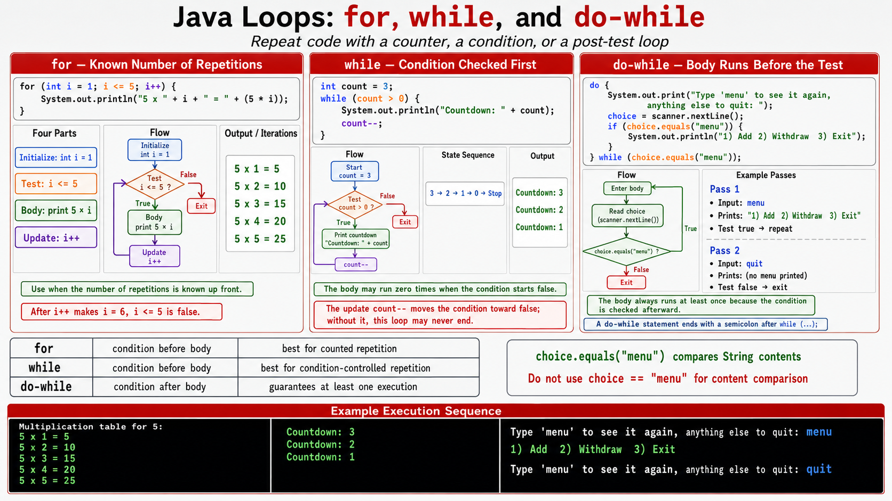

# Exercise 3 — Loops

**Module 2** · Pre-lab practice · then open [`../lab2/LAB-2-GUIDE.md`](../lab2/LAB-2-GUIDE.md)  
**Folder:** `examples/module-02-exercises/` ([setup](EXERCISES-INDEX.md))



> **New for Module 2:** `for`, `while`, and `do-while` — Java's three ways to repeat.

## Goal

Create `LoopsDemo.java` that prints a multiplication table with `for`, counts down with `while`, and shows a menu prompt at least once with `do-while`.

## Starter / reference (with line comments)

```java
import java.util.Scanner;

public class LoopsDemo {
    public static void main(String[] args) {
        // for: use when you know the number of repetitions up front
        System.out.println("Multiplication table for 5:");
        for (int i = 1; i <= 5; i++) {
            System.out.println("5 x " + i + " = " + (5 * i));
        }

        // while: use when repetition depends on a condition, checked before each pass
        int count = 3;
        while (count > 0) {
            System.out.println("Countdown: " + count);
            count--;                        // must move toward false, or this loops forever
        }

        // do-while: body runs once before the condition is checked
        Scanner scanner = new Scanner(System.in);
        String choice;
        do {
            System.out.print("Type 'menu' to see it again, anything else to quit: ");
            choice = scanner.nextLine();
            if (choice.equals("menu")) {
                System.out.println("1) Add  2) Withdraw  3) Exit");
            }
        } while (choice.equals("menu"));

        scanner.close();
    }
}
```

| Idea | Easy meaning |
| ---- | ------------ |
| `for` | Repeat a known number of times |
| `while` | Repeat while a condition stays true; may run zero times |
| `do-while` | Same as `while`, but the body always runs at least once |

## Steps

### Step 1 — Create `LoopsDemo.java`

**Why:** Lab 2's student menu repeats until the user chooses to exit — that is a `do-while`.

1. **New → File** → `LoopsDemo.java`.
2. Paste the starter. Save.

### Step 2 — Compile and run

**Windows:**

```powershell
cd $env:USERPROFILE\java-bootcamp\examples\module-02-exercises
javac LoopsDemo.java
java LoopsDemo
```

**macOS:**

```bash
cd ~/java-bootcamp/examples/module-02-exercises
javac LoopsDemo.java
java LoopsDemo
```

**Verified (Windows)** — typing `menu` once, then `quit`:

```text
Multiplication table for 5:
5 x 1 = 5
5 x 2 = 10
5 x 3 = 15
5 x 4 = 20
5 x 5 = 25
Countdown: 3
Countdown: 2
Countdown: 1
Type 'menu' to see it again, anything else to quit: menu
1) Add  2) Withdraw  3) Exit
Type 'menu' to see it again, anything else to quit: quit
```

## Expected result

Table prints 5x1 through 5x5, countdown prints 3 to 1, and the menu prompt appears again only after typing `menu`.

## If it fails

| Problem | Fix |
| ------- | --- |
| Countdown never ends | Confirm `count--` is inside the loop body, not after it |
| Menu never appears even once | That is `do-while`'s whole point — check the body runs before the condition test |

## Pass criteria

| # | Confirm | Your notes |
| - | ------- | ---------- |
| 1 | All three loops produce the expected output | Pass / Fail |
| 2 | You can explain why `do-while` always runs its body once | Pass / Fail |
