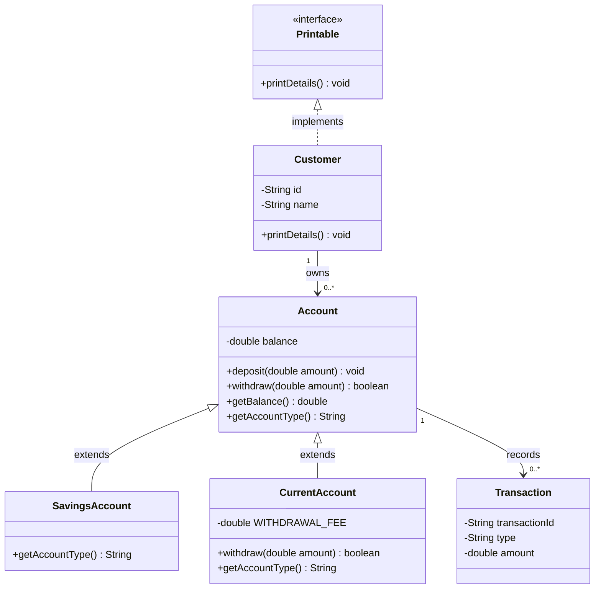

# Banking mini UML

- Inheritance: SavingsAccount and CurrentAccount are specialized Accounts.
Since they both extend Account, they are specialized Account instances.
- Interface realization: Customer promises Printable behavior.
Since Customer implements Printable, it MUST include a personal printDetails() method.
- Association: One Customer may own many Accounts.
True, a customer can have multiple instances of both SavingsAccounts and CurrentAccounts.
- Association: One Account may record many Transactions.
True, an account can have multiple transactions recorded, for both Savings and Current accounts.