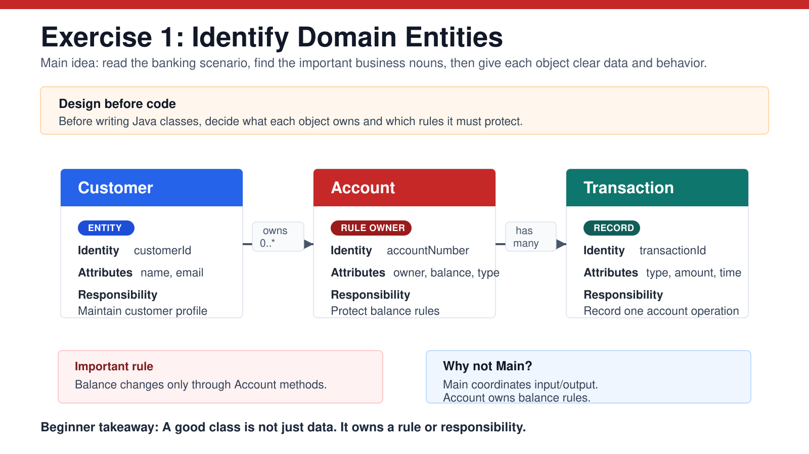

# Exercise 1 — Identify Domain Entities

**Module 3** · Pre-lab practice · finish all 8 Pass, then [`../lab3/LAB-3-GUIDE.md`](../lab3/LAB-3-GUIDE.md)  
**Folder:** `examples/module-03-exercises/` ([setup](EXERCISES-INDEX.md))



> **Design before code:** Lab 3 is a banking system. First translate the business description into objects with focused responsibilities.

## Goal

Create `notes.md` containing an entity table for `Customer`, `Account`, and `Transaction`. Identify useful attributes, one main responsibility, and relationships.

## Scenario

A bank employee needs to:

- register customers;
- open savings or current accounts;
- deposit and withdraw money;
- retain a record of each transaction;
- display customer and account details.

## Key vocabulary

| Term | Easy meaning | Banking example |
| ---- | ------------ | --------------- |
| Entity | A distinct domain thing with identity | Customer `C101` |
| Attribute | Data the entity owns | customer name, account balance |
| Responsibility | Work the entity should perform | account validates a withdrawal |
| Relationship | How entities connect | customer owns accounts |
| Invariant | Rule that must remain true | balance changes only through account methods |

## Steps

### Step 1 — Find candidate entities

**Why:** Important nouns in requirements often become classes, but not every noun deserves a class.

Read the scenario and underline the business nouns. Start with:

- `Customer`
- `Account`
- `Transaction`

Do **not** create classes for implementation details such as “menu option” or “printed line.”

### Step 2 — Create `notes.md`

**Why:** A short design note catches unclear ownership before code spreads responsibilities across the wrong classes.

Create `notes.md` in `module-03-exercises` and add:

```markdown
# Banking domain notes

| Entity | Identity | Important attributes | Main responsibility |
| ------ | -------- | -------------------- | ------------------- |
| Customer | customerId | name, email, phone | Maintain customer profile |
| Account | accountNumber | owner, balance, accountType | Protect balance and perform deposits/withdrawals |
| Transaction | transactionId | account, type, amount, timestamp | Record one account operation |
```

### Step 3 — Add relationships and rules

**Why:** Attributes alone do not explain how objects collaborate.

Below the table, add:

```markdown
## Relationships

- One Customer can own zero or more Accounts.
- One Account belongs to exactly one Customer.
- One Account can have many Transactions.
- One Transaction belongs to exactly one Account.

## Rules

- An account balance cannot be changed directly from outside Account.
- A deposit amount must be positive.
- A withdrawal cannot exceed the allowed balance.
```

### Step 4 — Explain one design decision

**Why:** Being able to justify ownership matters more than merely listing nouns.

Answer in 2–3 sentences:

> Why should `Account`, rather than `Main`, decide whether a withdrawal is valid?

Suggested idea: `Account` owns the balance and its rules, while `Main` should only coordinate user interaction.

## Expected result

`notes.md` contains at least three entities, useful attributes, focused responsibilities, relationships, multiplicities, and business rules.

## Common mistakes

| Mistake | Better design |
| ------- | ------------- |
| `Customer` deposits money directly by changing balance | Ask `Account` to perform the deposit |
| `Main` owns every business rule | Keep `Main` as a thin coordinator |
| “Database” is modeled as a banking entity | Treat storage as infrastructure, not domain identity |
| Responsibility says only “stores data” | State useful behavior or ownership |

## Pass criteria

_Mark each row **Pass** or **Fail** in your lab notes._

| # | Confirm | Your notes |
| - | ------- | --------- |
| 1 | `notes.md` identifies at least Customer, Account, Transaction | Pass |
| 2 | Every entity has attributes and one focused responsibility | Pass |
| 3 | Relationships include one-to-many multiplicities | Pass |
| 4 | You can explain why Account owns withdrawal validation | Pass |
