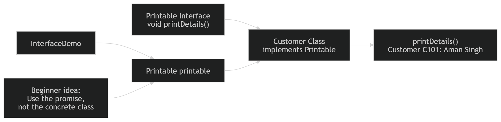

# Exercise 5 — Interface Practice

**Module 3** · Pre-lab practice · then open [`../lab3/LAB-3-GUIDE.md`](../lab3/LAB-3-GUIDE.md)  
**Folder:** `examples/module-03-exercises/` ([setup](EXERCISES-INDEX.md))



> **New design idea:** Inheritance says what an object **is**; an interface states a capability an object promises to provide.

## Goal

Create a `Printable` contract, implement it in `Customer`, and invoke the method through a `Printable` reference.

## Starter / reference

### `Printable.java`

```java
public interface Printable {
    // Interface method is public and abstract by default.
    void printDetails();
}
```

### `Customer.java`

```java
public class Customer implements Printable {
    private final String id;
    private final String name;

    public Customer(String id, String name) {
        this.id = id;
        this.name = name;
    }

    @Override
    public void printDetails() {
        System.out.printf(
                "Customer %s: %s%n", id, name);
    }
}
```

### `InterfaceDemo.java`

```java
public class InterfaceDemo {
    public static void main(String[] args) {
        // Variable knows only the Printable contract.
        Printable printable =
                new Customer("C101", "Aman Singh");

        printable.printDetails();
    }
}
```

| Idea | Easy meaning |
| ---- | ------------ |
| `interface Printable` | Defines a contract, not customer state |
| `implements Printable` | Customer promises to supply every required method |
| `Printable printable` | Code depends on capability rather than concrete class |
| `@Override` | Compiler checks the implementation matches the contract |

## Steps

### Step 1 — Create the contract

**Why:** The caller should be able to request “print your details” without knowing whether the object is a customer or account.

Create `Printable.java` and add the starter interface.

### Step 2 — Create the implementation

**Why:** An implementing class decides how its own details should be displayed.

Create `Customer.java`, add `implements Printable`, and implement `printDetails()`.

### Step 3 — Create and run the demo

Create `InterfaceDemo.java`.

**Windows:**

```powershell
cd $env:USERPROFILE\java-bootcamp\examples\module-03-exercises
javac Printable.java Customer.java InterfaceDemo.java
java InterfaceDemo
```

**macOS:**

```bash
cd ~/java-bootcamp/examples/module-03-exercises
javac Printable.java Customer.java InterfaceDemo.java
java InterfaceDemo
```

**Verified (Windows):**

```text
Customer C101: Aman Singh
```

### Step 4 — Run a failure experiment

**Why:** The compiler enforces interface contracts.

Temporarily remove `printDetails()` from `Customer`, then compile. Expected message includes:

```text
Customer is not abstract and does not override abstract method printDetails()
```

Restore the method before continuing.

## Expected result

The customer’s implementation runs even though the variable is declared as `Printable`.

## If it fails

| Problem | Fix |
| ------- | --- |
| Interface method has weaker access | Implementation must be `public` |
| `cannot find symbol Printable` | Compile `Printable.java` with the other files |
| Method does not override | Match `void printDetails()` exactly |

## Pass criteria

| # | Confirm | Your notes |
| - | ------- | ---------- |
| 1 | Output prints `Customer C101: Aman Singh` | Pass / Fail |
| 2 | The reference type in the demo is `Printable` | Pass / Fail |
| 3 | You can distinguish `extends` from `implements` | Pass / Fail |
