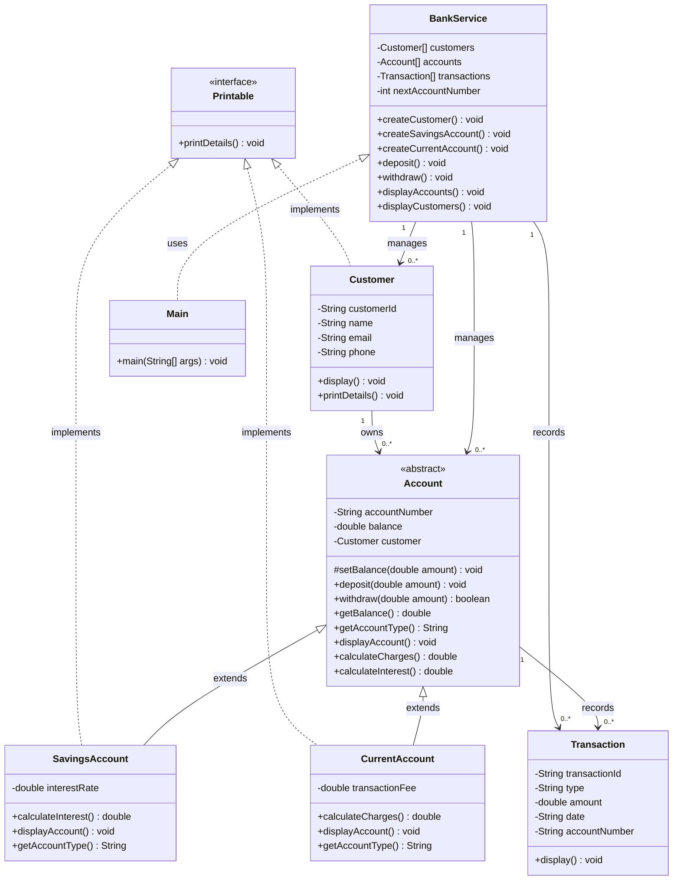

# Banking mini UML

```mermaid
classDiagram
    class Printable {
        <<interface>>
        +printDetails() void
    }

    class Customer {
        -String customerId
        -String name
        -String email
        -String phone
        +display() void
        +printDetails() void
    }

    class Account {
        <<abstract>>
        -String accountNumber
        -double balance
        -Customer customer
        
        #setBalance(double amount) void
        +deposit(double amount) void
        +withdraw(double amount) boolean
        +getBalance() double
        +getAccountType() String
        +displayAccount() void
        +calculateCharges() double
        +calculateInterest() double
    }

    class SavingsAccount {
        -double interestRate
        
        +calculateInterest() double
        +displayAccount() void
        +getAccountType() String
    }

    class CurrentAccount {
        -double transactionFee
        
        +calculateCharges() double
        +displayAccount() void
        +getAccountType() String
    }

    class Transaction {
        -String transactionId
        -String type
        -double amount
        -String date
        -String accountNumber
        
        +display() void
    }
    
    class Main {
        +main(String[] args) void
    }
    
    class BankService {
        -Customer[] customers
        -Account[] accounts
        -Transaction[] transactions
        -int nextAccountNumber
        
        +createCustomer() void
        +createSavingsAccount() void
        +createCurrentAccount() void
        +deposit() void
        +withdraw() void
        +displayAccounts() void
        +displayCustomers() void
    }

    Printable <|.. Customer : implements
    Printable <|.. SavingsAccount : implements
    Printable <|.. CurrentAccount : implements
    Account <|-- SavingsAccount : extends
    Account <|-- CurrentAccount : extends
    Customer "1" --> "0..*" Account : owns
    BankService "1" --> "0..*" Transaction : records
    BankService <|.. Main : uses
    BankService "1" --> "0..*" Customer : manages
    BankService "1" --> "0..*" Account : manages
    Account "1" --> "0..*" Transaction : records
```