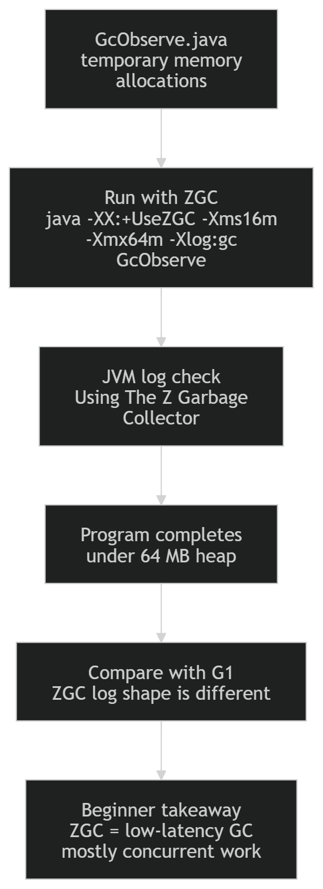

# Exercise 5 — Select and Verify ZGC

**Module 4** · Pre-lab practice · then open [`../lab4/LAB-4-GUIDE.md`](../lab4/LAB-4-GUIDE.md)  
**Folder:** `examples/module-04-exercises/` ([setup](EXERCISES-INDEX.md))



> **Reuse Exercise 3:** No new Java file is needed. Run `GcObserve` again with ZGC selected instead of G1.

## Goal

Select the ZGC garbage collector explicitly, verify the JVM accepted it, and contrast what you see in the log with Exercise 4's G1 run.

## Key idea

ZGC is a low-latency collector designed to keep pause times very short (typically sub-millisecond) even on large heaps, by doing almost all of its work concurrently with the running application. G1 favors balanced throughput and pause goals; ZGC trades some throughput for consistently tiny pauses.

## Steps

### Step 1 — Confirm the class exists

From Exercise 3, you should still have:

```text
GcObserve.java
GcObserve.class
```

If the `.class` file is missing:

```text
javac GcObserve.java
```

### Step 2 — Run with explicit ZGC selection

**Windows and macOS:**

```text
java -XX:+UseZGC -Xms16m -Xmx64m -Xlog:gc GcObserve
```

| Flag | Purpose |
| ---- | ------- |
| `-XX:+UseZGC` | Select ZGC |
| `-Xlog:gc` | Show collector activity |
| `-Xms16m -Xmx64m` | Keep the bounded exercise heap |

**Verified (Windows/JDK 21)** — beginning of output:

```text
[info][gc] Using The Z Garbage Collector
[info][gc] GC(0) Garbage Collection (Warmup) ...
```

### Step 3 — Verify configuration directly

Run:

```text
java -XX:+UseZGC -XX:+PrintCommandLineFlags -version
```

Look for:

```text
-XX:+UseZGC
```

### Step 4 — Compare against Exercise 4's G1 log

Add to `notes.md`:

```markdown
Command:
java -XX:+UseZGC -Xms16m -Xmx64m -Xlog:gc GcObserve

Evidence:
The log began with "Using The Z Garbage Collector" instead of "Using G1".
Pause-related log lines look different — ZGC does most of its work concurrently,
so it does not report the same kind of stop-the-world "Evacuation Pause" G1 does.
```

## Expected result

The JVM starts successfully, prints `Using The Z Garbage Collector`, and the bounded allocation program completes — with a visibly different collector log shape than the G1 run in Exercise 4.

## If it fails

| Problem | Fix |
| ------- | --- |
| `Unrecognized VM option` | Confirm `java -version` reports JDK 21 |
| Flag placed after class name | Put every JVM flag before `GcObserve` |
| No `Using The Z Garbage Collector` line | Include `-Xlog:gc` |
| Log looks nearly identical to G1 | Double-check you passed `-XX:+UseZGC`, not `-XX:+UseG1GC` |

## Pass criteria

| # | Confirm | Your notes |
| - | ------- | ---------- |
| 1 | Log explicitly says `Using The Z Garbage Collector` | Pass / Fail |
| 2 | Program still completes under the bounded heap | Pass / Fail |
| 3 | You can name one difference between the G1 and ZGC log output | Pass / Fail |
