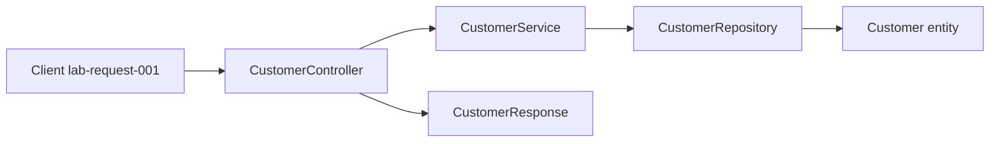

# Layer flow — create Amina Khan (`CUS-1001`)

Correlation ID: `lab-request-001`

1. **Client sends create request** (correlation ID `lab-request-001`)
   (FUTURE: this ID will be logged at every layer once logging is complete later on)
2. **`CustomerController` accepts `CustomerRequest`** 
    Presentation owns translating a transport call into a service call and handing the result back. Input validation will be implemented at or just inside this boundary at a later step. The controller must never touch SQL or make business decisions.
3. **`CustomerService` applies business rules**
   (1) Unique ID generation (CUS-####) and assignment
   (2) Default status to `ACTIVE` if not provided
    This is the only layer allowed to make these business decisions, not the controller or repository.
4. **`CustomerRepository` stores `Customer` entity**
    NOW: in-memory stub only, throws `UnsupportedOperationException`; FUTURE: will persist to PostgreSQL via JPA.
5. **Response DTO returns `CUS-1001` / `ACTIVE`**
    What must NOT leak: the internal entity structure, database IDs, or any other internal storage / implementation details. The response should only contain the fields defined in `CustomerResponse`.

## NOW vs FUTURE

- **NOW (Lab 8):** skeleton + stubs only
- **FUTURE:** React SPA, Kafka, PostgreSQL / Spring Boot — out of scope for Lab 8

## Diagram

