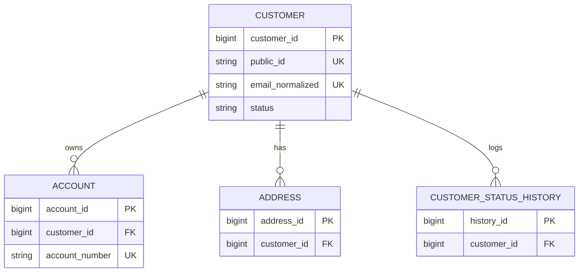

```mermaid
erDiagram
    CUSTOMER ||--o{ ACCOUNT : owns
    CUSTOMER ||--o{ ADDRESS : has
    CUSTOMER ||--o{ CUSTOMER_STATUS_HISTORY : logs
    CUSTOMER {
        bigint customer_id PK
        string public_id UK
        string email_normalized UK
        string status
    }
    ACCOUNT {
        bigint account_id PK
        bigint customer_id FK
        string account_number UK
    }
    ADDRESS {
        bigint address_id PK
        bigint customer_id FK
    }
    CUSTOMER_STATUS_HISTORY {
        bigint history_id PK
        bigint customer_id FK
    }
```